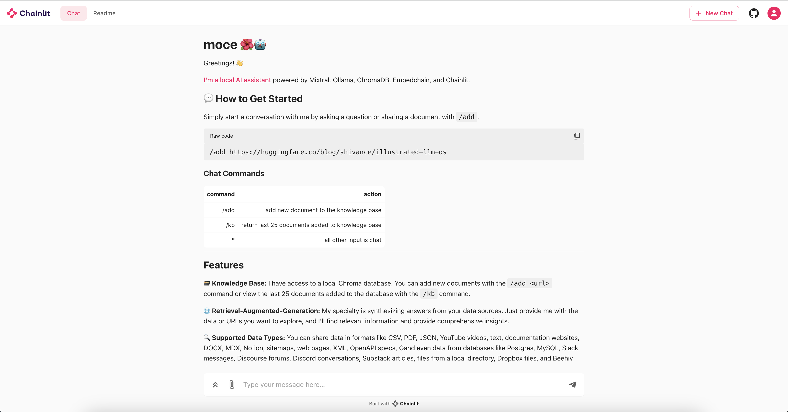

# moce 🌺🤖

Simple, fully local retrieval-augmented-generation powered by Ollama, Emedchain, and Chainlit.

* **LLM:** [dolphin-mixtral](https://ollama.ai/library/dolphin-mixtral)
* **Inference:** [Ollama](https://ollama.ai/)
* **Web UI:** [Chainlit](https://chainlit.io/)
* **RAG & Chat:** [Embedchain](https://embedchain.ai/)
* **Vector DB:** [Chroma](https://www.trychroma.com/)



## Setup

### Install Ollama

[Download and install Ollama](https://ollama.ai/library/dolphin-mixtral)

The [embedchain config](data/config.yaml) uses [dolphin-mixtral](https://ollama.ai/library/dolphin-mixtral) by default, but you can swap this out for any other model.

### Clone the repository

```bash
git clone https://github.com/deadbits/moce.git
cd moce
```

### Setup Python virtual environment
```bash
python3 -m venv venv
source venv/bin/activate
```

### Install Python requirements

```bash
pip install -r requirements.txt
```

### Set Hugging Face API token
This is required during the first run to download the embedding model.

```bash
export HUGGINGFACE_API_TOKEN="hf_..."
```

### Start ChromaDB Docker
```bash
docker pull chromadb/chroma
docker run -d -p 8000:8000 chromadb/chroma
```

## Run
```bash
chainlit run moce.py --port 8888
```

### Chat Commands
| **command** | **action**                                            |
|-------------|-------------------------------------------------------|
| /add <url>       | add new document to the knowledge base           |
| /kb              | return last 25 documents added to knowledge base |
| *                | all other input is chat                          |

### Add Data
You can start a conversation by asking a question or sharing a document with the `/add` command.

**Add data to knowledge base**

```
/add https://huggingface.co/blog/shivance/illustrated-llm-os
```

### View KB
Document names added to your knowledge base are tracked in `data/indexed.json`.
The `/kb` command will return the last 25 document names.
